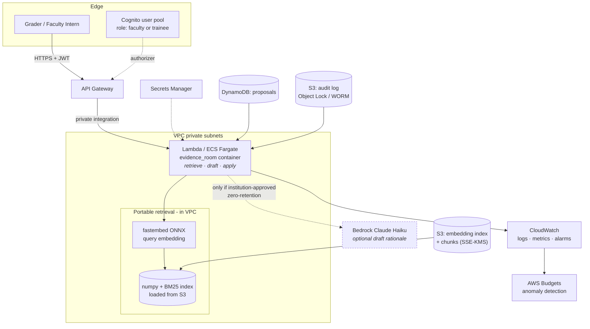
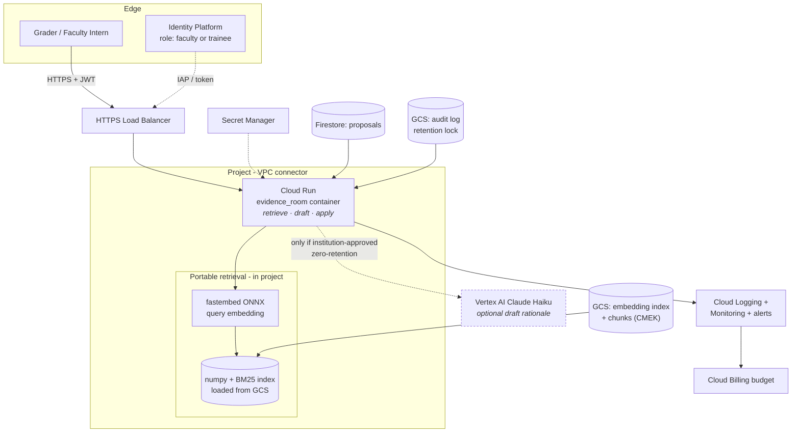

# Architecture: two clouds, one contract

Both clouds run the **same container image** - the `evidence_room` package behind
a thin HTTP layer exposing `/retrieve`, `/draft`, `/apply` (the
[contract](contract.md)). What differs is the managed services around it. The
guiding decision is *managed vs portable*, resolved at the end of this doc.

## Service mapping

| Contract concern | AWS | GCP | Portable layer (recommended) |
|---|---|---|---|
| Ingress / API | API Gateway → Lambda (or ALB → ECS Fargate) | Cloud Run | same container both clouds |
| Compute | Lambda (Arm) / ECS Fargate | Cloud Run | container |
| Embeddings | Bedrock Titan Text Embeddings V2 | Vertex `text-embedding` | **`fastembed` in-container (in-VPC)** |
| Vector search | OpenSearch Serverless / Bedrock Knowledge Bases | Vertex AI Vector Search | **`numpy` cosine + BM25 over an index in object storage** |
| Draft rationale | deterministic (default) / Bedrock Claude Haiku | deterministic / Vertex Claude Haiku | deterministic composer |
| Object storage | S3 | Cloud Storage | - |
| Secrets | Secrets Manager | Secret Manager | - |
| Audit / proposals | DynamoDB + S3 (object lock) | Firestore + GCS (retention) | - |
| Identity | IAM + Cognito | IAM + Identity Platform | - |
| Observability | CloudWatch Logs/Metrics/Alarms | Cloud Logging/Monitoring | structured JSON logs |
| Cost guardrail | AWS Budgets + anomaly detection | Cloud Billing budgets + alerts | - |

## AWS deployment

## GCP deployment

The two diagrams are deliberately isomorphic: same boxes, same edges, different
labels. That isomorphism *is* the contract holding.

## Managed vs portable: the decision

The lab's core tradeoff. Two ways to satisfy the retrieval part of the contract:

**Managed** - Bedrock Knowledge Bases + OpenSearch Serverless (AWS) / Vertex AI
Vector Search (GCP). The cloud owns ingestion, chunking, embedding, and ANN
search.

**Portable** - the `evidence_room` retriever (fastembed + numpy cosine + BM25)
runs inside the container; the cloud provides only compute, object storage,
secrets, identity, and observability.

| Dimension | Managed | Portable |
|---|---|---|
| Contract parity across clouds | two different services to keep in lockstep | **one code path, byte-identical retrieval** |
| Data residency | proof text leaves the VPC to the managed embedder | **proof text never leaves the trust boundary** |
| Cost at ≤10k tasks/week | **$200–700/mo always-on vector floor** | **~$10–40/mo**, scales to ~zero when idle |
| Chunking control | provider's chunker (our type-aware chunking is the whole thesis) | **our type-aware, access-scoped chunking preserved** |
| Access scoping / permissions | must re-express filters in the provider's model | **enforced in our code, already tested** |
| Ops burden at our scale | provider patches, scales | we own the (small) index refresh |
| When managed wins | corpus in the millions, high QPS, ANN latency matters | **our regime: ~25k chunks, ≤10k tasks/week** |

**Recommendation: portable.** Three of the constraints that have shaped this
project point the same way. (1) *Data residency* - managed embedding sends
consented student coursework to the provider's endpoint; portable keeps it
in-VPC. (2) *Cost* - at ≤10k weekly tasks the workload is trivial in token terms,
so a managed vector store's always-on floor ($200 - 700/mo) dwarfs the entire
portable stack ([cost-estimate.md](cost-estimate.md)). (3) *The chunking and
access-scoping are the product* - handing them to a provider's generic RAG
pipeline discards the type-aware chunking and pre-retrieval permission filter
that the earlier stages exist to provide.

Managed becomes the right call when the corpus grows into the millions or QPS
makes brute-force cosine too slow - at which point the portable interface swaps
its index backend for OpenSearch/Vertex behind the *same* `HybridRetriever` API,
without touching the contract. The portable layer is not anti-cloud; it is the
seam that keeps the cloud choice reversible.

The optional Claude draft-rationale (Bedrock/Vertex) is the one managed model
call worth keeping on the table - but it is gated behind the same zero-retention
requirement, and off by default in favour of the deterministic composer.
